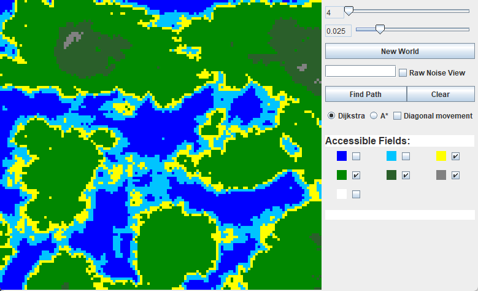

# Pathfinding in a randomly generated world

A project I have done in school for finals. Uses [FastNoiseLite](https://github.com/Auburn/FastNoiseLite) for noise and world generation.

There is an attached [pdf](Projektarbeit.pdf) describing the project in detail, although it is written only in German.

The original interface text has been translated into English for easier understanding, so there may be some differences from the text in pdf and current state of the project.

### Usage

Buttons and sliders on the side panel should be self-explanatory. 

They allow changing the size of the map, noise frequency, defining seed or generating a map with a new random seed.

As for pathfinding there are two algorithm available, A* and Dijkstra.
Both can have diagonal movement enabled in addition to A* having Tie-Break functionality with a definable Heuristics multiplier.
With checkboxes, it is possible to define which fields should be accessible for movement.

**In order to set starting and end points, use left mouse click for start and right mouse click for goal.**

The following are default weights/costs for each field type
- Deep Water: 6
- Water: 3
- Sand: 1.5
- Flat: 1
- Forest: 2.5
- Mountain: 6.5
- Mountaintop: 7

